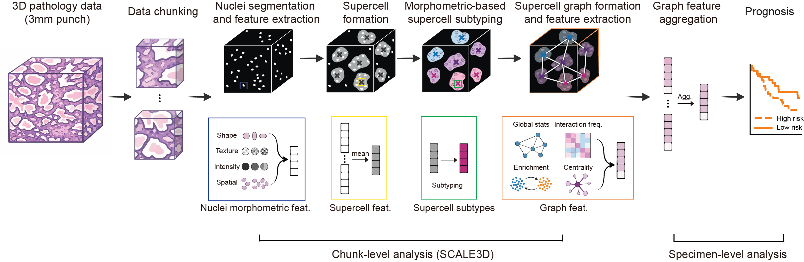

# SCALE3D

Scalable 3D pathology cell-interaction analysis via supercell graphs for prostate cancer risk stratification.



## Overview

SCALE3D processes 3D pathology images in four stages:

1. **Nuclei segmentation and feature extraction** segments nuclei and calculates per-nucleus morphology, intensity, texture, neighborhood, gland, and spatial features.
2. **Supercell formation** groups spatially adjacent and morphologically similar nuclei into supercells.
3. **Supercell subtyping** learns cohort-level epithelial and stromal supercell subtypes using PCA, Harmony, a neighbor graph, and Leiden clustering.
4. **Graph construction and feature extraction** constructs spatial supercell graphs and aggregates their interaction, enrichment, centrality, and topology measurements into one feature vector per specimen.

| Stage | Main input | Main output |
| --- | --- | --- |
| 1. Segmentation and nuclear features | 3D HDF5 volume and gland mask | Nucleus masks and per-nucleus arrays |
| 2. Supercell formation | Per-nucleus arrays and fitted scaler | Per-supercell arrays and membership maps |
| 3. Supercell subtyping | Cohort supercell arrays | Epithelial and stromal `.h5ad` files |
| 4. Graph features | Supercells, subtype files, and metadata | Specimen-level SCALE3D feature CSV |


## Environment

Stage 1 and stages 2–4 use separate environments because Cellpose 3 requires an older NumPy range than the RAPIDS workflow.

For stage 1, use the Cellpose environment:

```bash
CONDA_CHANNEL_PRIORITY=strict conda env create --solver libmamba -f environment-stage1.yml
conda activate scale3d-cellpose
```


For stages 2–4, create the dedicated RAPIDS environment:

```bash
CONDA_CHANNEL_PRIORITY=strict PIP_NO_DEPS=1 conda env create --solver libmamba -f environment-stage2-4.yml
conda activate scale3d-nested-loocv
```

## Included example data

> **Test-data notice:** The test data are provided only to illustrate the SCALE3D workflow and verify that each pipeline stage runs successfully. They are not intended to reproduce the study results. The parameters used for the analyses reported in this study are documented in the manuscript.

The examples below show only required arguments and values that differ from the script defaults. Run any script with `--help` to see all available arguments and their default values

```text
test_data/
├── Test1/{image.h5,gland_mask.nii.gz}
├── Test2/{image.h5,gland_mask.nii.gz}
├── Test3/{image.h5,gland_mask.nii.gz}
├── scale3d_test_samples.csv
└── feat53_mean_std_scaler.pkl
```

## 1. Nuclei segmentation and nuclear feature extraction

### 1.1 Nuclei segmentation

Script: `01.Nulcei_segmentation_and_feature_extraction/Nuclei_segmentation.py`

#### Output

```text
cellpose/
├── mask_blk_<x>_<y>.nii.gz
├── imgdn_blk_<x>_<y>.nii.gz
├── mask_blk_<x>_<y>.avi       # optional
└── imgdn_blk_<x>_<y>.avi      # optional
```

#### Illustrative test-data example

```bash
for SAMPLE in Test1 Test2 Test3; do
  python 01.Nulcei_segmentation_and_feature_extraction/Nuclei_segmentation.py \
    --h5 "test_data/${SAMPLE}/image.h5" \
    --depth 64 \
    --block_size 128 \
    --grid_size 2 \
    --visualization true
done
```


### 1.2 Nuclear feature extraction

Script: `01.Nulcei_segmentation_and_feature_extraction/Feature_extraction.py`

The code clears border-touching nuclei, removes objects smaller than 150 voxels, and calculates morphology, nuclear/cytoplasmic intensity, crowdedness, entropy, GLCM texture, gland membership, and coordinates.

#### Output

```text
individual_cells/
├── feature53_blk_<x>_<y>.npz
└── label53_blk_<x>_<y>.npz
```
The feature53_blk array contain 12 morphology, 10 intensity/crowdedness, 1 entropy, and 30 three-plane GLCM features. The label array contains the connected-component ID corresponding to every row.

#### Illustrative test-data example

```bash
for SAMPLE in Test1 Test2 Test3; do
  python 01.Nulcei_segmentation_and_feature_extraction/Feature_extraction.py \
    --h5 "test_data/${SAMPLE}/image.h5" \
    --CellposeDir "test_data/${SAMPLE}/cellpose" \
    --gland "test_data/${SAMPLE}/gland_mask.nii.gz" \
    --depth 64 \
    --block_size 128 \
    --grid_size 2 \
    --temp_dir "/tmp/scale3d_${SAMPLE}"
done
```

This writes `feature53_blk_<x>_<y>.npz` and `label53_blk_<x>_<y>.npz` to `test_data/<SAMPLE>/individual_cells/`. A small example block may contain no nuclei after postprocessing; in that case, its saved arrays are empty.

## 2. Supercell formation

Script: `02.Supercell_formation/super_cell_identification.py`

### Output

Each feature array has **270 columns**:

| Columns | Contents |
| --- | --- |
| `0` | Nucleus count within each supercell |
| `1:54` | Mean of 53 nucleus features |
| `54:107` | Minimum |
| `107:160` | Maximum |
| `160:213` | Standard deviation |
| `213:266` | Median |
| `266:269` | Local `(z, x, y)` centroid |
| `269` | `1` epithelial or `0` stromal |

The membership `.npy` is a pickled dictionary from supercell row index to nucleus IDs:

```python
membership = np.load("nucleiId_file.npy", allow_pickle=True).item()
```

### Illustrative test-data example

```bash
for SAMPLE in Test1 Test2 Test3; do
  python 02.Supercell_formation/super_cell_identification.py \
    --cellseg "test_data/${SAMPLE}/cellpose" \
    --normalization test_data/feat53_mean_std_scaler.pkl \
    --patch_size 128 \
    --block_size 128 \
    --grid_size 2 \
    --slide_size 256 \
    --distance_thres 10 \
    --min_size 1 \
    --min_cells_per_type 1 \
    --epithelium_label 2 \
    --stroma_label 3
done
```

## 3. Supercell subtyping

Script: `03.Supercell_subtyping/cluster_supercell.py`

This is a cohort-level step and must be run separately for epithelial and stromal supercells.

### Output

| AnnData location | Contents |
| --- | --- |
| `adata.X` | 53 mean features |
| `adata.obs["cell_type"]` | Compartment label |
| `adata.obs["slide_id"]` | Specimen identifier |
| `adata.obs["leiden_harmony"]` | Learned subtype |
| `adata.obsm["centroids"]` | Global `(z, x, y)` centroids |
| `adata.obsm["X_pca_harmony"]` | Harmony representation |
| `adata.obsm["X_umap_harmony"]` | UMAP coordinates |

### Illustrative epithelial test-data example

```bash
python 03.Supercell_subtyping/cluster_supercell.py \
  --file_list test_data/scale3d_test_samples.csv \
  --supercell_root test_data \
  --data supercell_128_feature53_r10_blk \
  --epithelial_or_stromal 1 \
  --outfile test_data/subtypes/epithelial_r10.h5ad \
  --neighbors 10 \
  --block_size 128 --grid_size 2 \
  --n_jobs 1 \
  --skip_umap
```

### Illustrative stromal test-data example

```bash
python 03.Supercell_subtyping/cluster_supercell.py \
  --file_list test_data/scale3d_test_samples.csv \
  --supercell_root test_data \
  --data supercell_128_feature53_r10_blk \
  --epithelial_or_stromal 0 \
  --outfile test_data/subtypes/stromal_r10.h5ad \
  --neighbors 10 \
  --block_size 128 --grid_size 2 \
  --n_jobs 1 \
  --skip_umap
```

## 4. Graph construction and graph feature extraction

Script: `04.Graph_construction_and_graph_feature_extraction/graph_formation_and_graph_feature_extraction.py`

### Output

The CSV has one row per successfully processed specimen. Columns follow `<aggregation>_<graph-feature>`, for example:

```text
mean_graph_density
max_graph_avg_degree
median_inter_freq_0_1
mean_enrichZ_2_4
std_centrality_3_degree_centrality
sample
label
```

This is the main SCALE3D specimen-level features.

### Illustrative test-data example

```bash
python 04.Graph_construction_and_graph_feature_extraction/graph_formation_and_graph_feature_extraction.py \
  --metadata_csv test_data/scale3d_test_samples.csv \
  --epi_h5ad test_data/subtypes/epithelial_r10.h5ad \
  --stromal_h5ad test_data/subtypes/stromal_r10.h5ad \
  --supercell_root test_data \
  --feature_file_prefix supercell_128_feature53_r10_blk \
  --output_csv test_data/features/scale3d_graph_features_r10.csv \
  --block_size 128 \
  --n_jobs 1
```

## Evaluation
This directory contains the final nested-LOOCV LASSO and Cox regression results, along with ROC/Kaplan–Meier visualizations and paired AUC, hazard-ratio, concordance-index, and log-rank statistical comparisons.